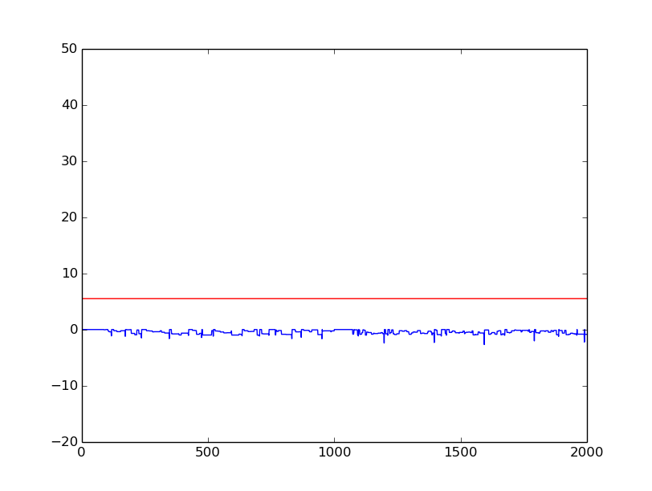

# Spiking-Neural-Network
This is the python implementation of hardware efficient spiking neural network. It includes the modified learning and prediction rules which could be realised on hardware and are enegry efficient. Aim is to develop a network which could be used for on-chip learning as well as prediction.

Spike-Time Dependent Plasticity (STDP) algorithm will be used to train the network.

  

## Network Elements
  * [Neuron](neuron/)
  * [Synapse](synapse/)
  * [Receptive field](receptive_field/)
  * [Spike train](encoding/)

## [SNN Simulator for Classification](classification/)
Assuming that we have learned the optimal weights of the network using the STDP algorithm (will be implemented next), this uses the weights to classify the input patterns into different classes. The simulator uses the 'winner-takes-all' strategy to supress the non firing neurons and produce distinguishable results. Steps involved while classifying the patterns are:

- For each input neuron membrane potential is calculated in its [receptive field](receptive_field/) (5x5 window).
- [Spike train](encoding/) is generated for each input neuron with spike frequency proportional to the membrane potential.
- Foe each image, at each time step, potential of the neuron is updated according to the input spike and the weights associated.
- First firing output neuron performs lateral inhibition on the rest of the output neurons. 
- Simulator checks for output spike.

### Results
The simulator was tested upon binary classification. It can be extended upto any number of classes. The images for two classes are:

          

Each of the classes were presented to the network for 1000 time units each. The activity of the neurons was recorded. Here are the graphs of the potential of output neurons versus time unit.

First 1000 TU corresponds to class1, next 1000 to class2. Red line indicates the threshold potential.

   

The 1st output neuron is active for class1, 2nd is active for class2, and 3rd and 4th are mute for both the classes. Hence, by recording the total spikes in output neurons, we can determine the class to which the pattern belongs.

## [Training an SNN](training)
In the previous section we assumed that our network is trained i.e weights are learned using STDP and can be used to classify patterns. Here we'll see how STDP works and what all need to be taken care of while implementing this training algorithm.

### Spike Time Dependent Plasticity
STDP is actually a biological process used by brain to modify it's neural connections (synapses). Since the unmatched learning efficiency of brain has been appreciated since decades, this rule was incorporated in ANNs to train a neural network. Moulding of weights is based on the following two rules -
- Any synapse that contribute to the firing of a post-synaptic neuron should be made strong i.e it's value should be increased.
- Synapses that don't contribute to the firing of a post-synaptic neuron should be dimished i.e it's value should be decreased.

Here is an explanation of how this algorithm works:

Consider the scenario depicted in this figure

  

Four neurons connect to a single neuron by synapse. Each pre synaptic neuron is firing at its own rate and the spikes are sent forward by the corresponding synapse. The intensity of spike translated to post synaptic neuron depends upon the strength of the connecting synapse. Now, because of the input spikes membrane potential of post synaptic neuron increases and sends out a spike after crossing the threshold. At the time when post synaptic neuron spikes, we'll monitor which all pre synaptic neurons helped it to fire. This could be done by observing which pre synaptic neurons sent out spikes before post synaptic neuron spiked. This way they helped in post synaptic spike by increasing the membrane potential and hence the corresponding synapse is strengthend. The factor by which the weight of synapse is increased is inversly proportional to the time difference between post synaptic and pre synaptic spikes given by this graph

  

### Generative Property of SNN
This property of Spiking Neural Network is very useful in analysing training process. All the synapses connected to an output layer neuron, if scaled to proper values and rearranged in form of an image, depicts what pattern that neuron has learned and how disctinctly it can classify that pattern. For an example, after training a network with MNIST dataset if we scale the weights of all the snypases connected to a particular output neuron (784 in number) and form a 28x28 image with those scaled up weights we will get a grayscale pattern learned by that neuron. This property will be used later while demonstrating the results. [This](training/reconstruct.py) file contains the function that reconstructs image from weights.

### Variable Threshold
In unsupervised learning it is very difficult to train a network where patterns have varied amount of activations (white pixels in case of MNIST). Patterns with higher activations tend to win in competetive learning and hence overshadow others (this problem will be demonstrated later). Therefore this method of normalization was introduced to bring them all down to same level. Threshold for each pattern is calculated based on the number of activation it contains. Higher the number of activations, higher is the threshold value. [This](training/var_th.py) file holds function to calculate threshold for each image.

### Lateral Inhibition
In neurobiology, lateral inhibition is the capacity of an excited neuron to reduce the activity of its neighbors. Lateral inhibition disables the spreading of action potentials from excited neurons to neighboring neurons in the lateral direction. This creates a contrast in stimulation that allows increased sensory perception. This propoerty is also called as Winner-Takes-All (WTA). The neuron that gets excited first inhibits (lowers down the membrane potential) of other neurons in same layer.

## Training for 3 class dataset
Here are the results after training an SNN using MNIST dataset with 3 classes (0-2) with 5 output neurons. We will leverage the generative property of SNN and reconstruct the images using trained weights connected to each output neuron to see how well the network has learned each pattern. Also, we see the membrane potential versus time plots for each output neuron to see how the training process was executes and made that neuron sensitive to a particular pattern only.

**Neuron1**

            

**Neuron2**

            

**Neuron3**

            

**Neuron4**

            

Here we can see clearly observe that Neuron 1 has learned pattern '1', Neuron 2 has learned '0', Neuron 3 is noise and Neuron 4 has learned '2'. Consider the plot of Neuron 1. In the beginning when the weights were randomly assigned it was firing for all the patterns. As the training proceeded, it became specific to pattern '1' only and was in inhibitory state for the rest. Onobserving Neuron 3 we can coclude that it reactsa to all the patterns and can be considered as noise. Hence, it is advisable to have 20% more output neurons than number of classes.

There is a slight overlapping of '2' and '0' which is a common problem in competetive learning. This can be eliminated proper fine tuning of parameters.

### Improper training
If we don't use variable threshold for normalization, we will observe some patterns over shadowing others. Here is an example:

  

Here same threshold voltage was used for both the patterns and hence resulted in overlapping. This could sbe avoided by either choosing a dataset where each image has more or less same number of activations or normalizing the number of activations.

## Parameters
Building a Spiking Neural Network from scratch not an easy job. There are several parameters that need to be tuned and taken care of. Combinations of so many parameters make it worse. Some of the major parameters that play an important role in the dynamics of network are -
 - Learning Rate
 - Threshold Potential
 - Weight Initialization
 - Number of Spikes Per Sample
 - Range of Weights
 
 I have demonstrated how some of these parameters affect the network and how they should be handeled [here](https://github.com/Shikhargupta/snn-brian-mlp/tree/master/simple_demo) under the heading Parameter Analysis.
 
 
## Contributions
I was helped on this project by my collegue at Indian Institute of Technology, Guwahati - Arpan Vyas. He further went on to design an architecture of hardware accelerator for this Simplified SNN and deploy it on FPGA and hence reducing the training time considerably. [Here](https://github.com/arpanvyas) is his Github profile.
