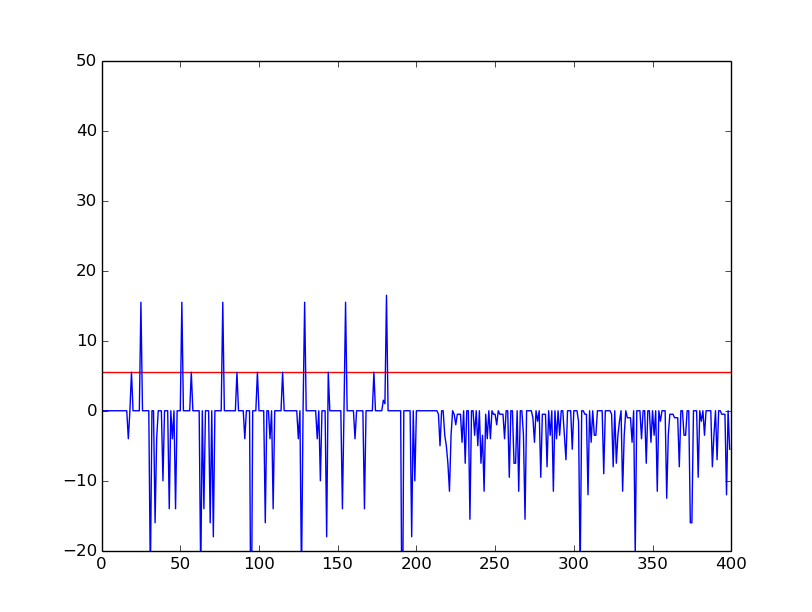
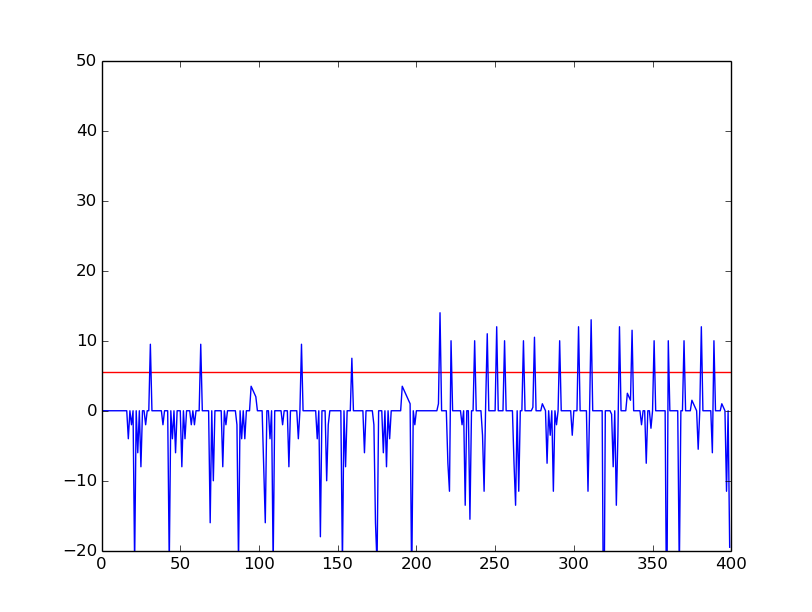
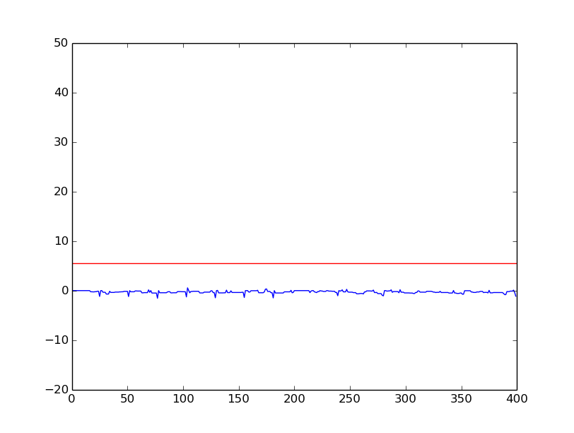
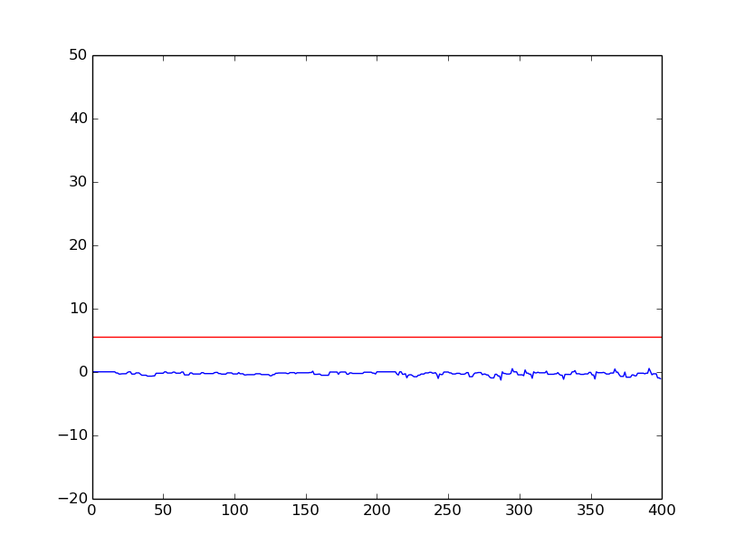

# Spiking-Neural-Network
This is the python implementation of hardware efficient spiking neural network. It includes the modified learning and prediction rules which could be realised on hardware and are enegry efficient. Aim is to develop a network which could be used for on-chip learning as well as prediction.

Spike-Time Dependent Plasticity (STDP) algorithm will be used to train the network.

  

## Network Elements
  * [Neuron] (neuron/)
  * [Synapse] (synapse/)
  * [Receptive field] (receptive_field/)
  * [Spike train] (encoding/)

## [SNN Simulator for Classification] (classification/)
Assuming that we have learned the optimal weights of the network using the STDP algorithm (will be implemented next), this uses the weights to classify the input patterns into different classes. The simulator uses the 'winner-takes-all' strategy to supress the non firing neurons and produce distinguishable results. Steps involved while classifying the patterns are:

- For each input neuron membrane potential is calculated in its [receptive field](receptive_field/) (5x5 window).
- [Spike train](encoding/) is generated for each input neuron with spike frequency proportional to the membrane potential.
- Foe each image, at each time step, potential of the neuron is updated according to the input spike and the weights associated.
- First firing output neuron performs lateral inhibition on the rest of the output neurons. 
- Simulator checks for output spike.

### Results
The simulator was tested upon binary classification. It can be extended upto any number of classes. The images for two classes are:

          

Each of the classes were presented to the network for 200 time units each. The activity of the neurons was recorded. Here are the graphs of the potential of output neurons versus time unit.

First 200 TU corresponds to class1, next 200 to class2. Red line indicates the threshold potential.

   

The 1st output neuron is active for class1, 2nd is active for class2, and 3rd and 4th are mute for both the classes. Hence, by recording the total spikes in utput neurons, we can determine the class to which the pattern belongs.
