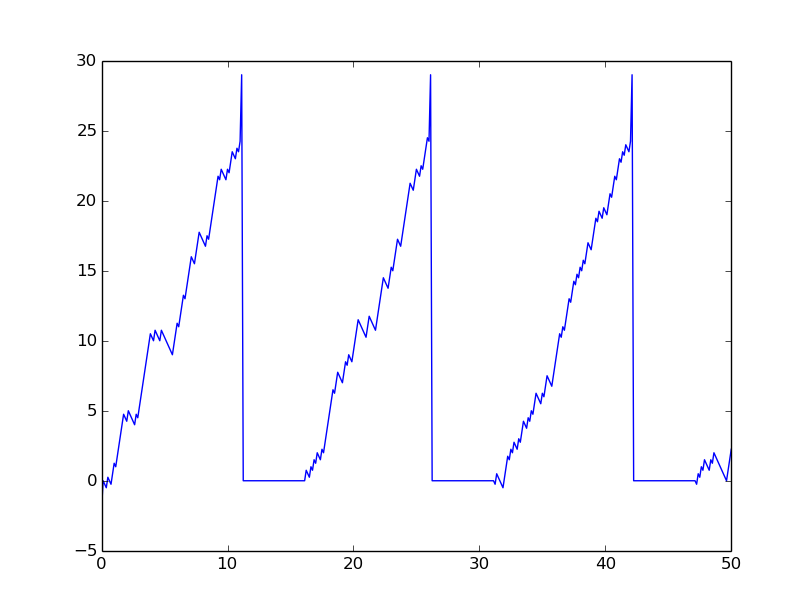
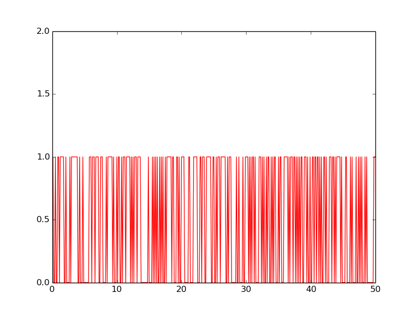

## Neuron
Neuron is the basic building block of an SNN and several interconnected neurons form the input, hidden and output layers. This neuron imitates the general [integrate and fire model] (http://neuronaldynamics.epfl.ch/online/Ch1.S3.html). 
* In the absence of stimulus, the membrane possesses a resting potential. Every input spike from connected neurons increases or decrease its membrane potential. 
* When the potential crosses a threshold value, neuron enters into refractory period in which no new input is allowed and the potential remains constant. 
* To avoid strong negative polarization of membrane, its potential is limited by Pmin.
* As long as Pn>Pmin, there is a constant leakage of potential.

## Graphs

  

Above graph shows the membrane potential throughout the 50 time units (TU) as a result of input spike train. Below is the corresponding randomly generated input spike train. 

  

